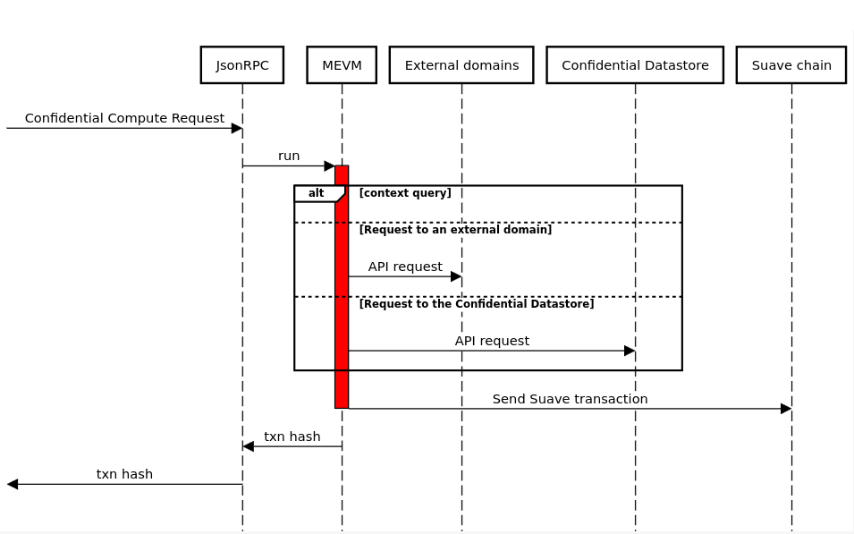

<!-- omit from toc -->
# Kettle

<div class="hideInDocs">

**Table of Contents**

<!-- TOC -->

- [Overview](#overview)
- [Prerequisites](#prerequisites)
- [Kettle Responsibilities](#Kettle-responsibilities)
- [Becoming a Kettle](#becoming-a-Kettle)
    - [Kettle Identification](#Kettle-identification)
- [Kettle Architecture](#Kettle-architecture)
    - [RPC](#rpc)
    - [SUAVE PoA Chain](#suave-poa-chain)
    - [MEVM](#mevm)
    - [Confidential Data Store](#confidential-data-store)
    - [Domain Specific Services](#domain-specific-services)
- [Containers](#containers)
    - [Confidential Compute Record](#confidential-compute-record)
    - [ConfidentialComputeRequest](#confidentialcomputerequest)
    - [Suave Transaction](#suave-transaction)
- [Honest Kettle](#honest-Kettle)
- [Confidential Computation](#confidential-computation)
    - [Confidential Compute Process](#confidential-compute-process)
    - [Suave JSON-RPC](#suave-json-rpc)

<!-- /TOC -->

</div>

## Overview

This document provides the technical specification for the SUAVE Kettle: one of the main protocol actors in the SUAVE protocol. The Kettle contains all necessary components to accept, process, and route confidential compute requests and results. Below the expected behavior of an "honest Kettle" with respect to Rigil testnet version of the SUAVE protocol is outlined.

## Prerequisites

All terminology, functions, and protocol mechanics defined in [SUAVE chain](./suave-chain.md), [Confidential Data Store](./confidential-data-store.md), and [MEVM](./mevm.md) are prerequisites for this document and used throughout. Please see the [Rigil overview](../../README.md) before continuing and use as a reference throughout.

## Kettle Responsibilities

A Kettle has several primary responsibilities within the SUAVE network:

1. **Handling Confidential Compute Requests:**
    - Process `ConfidentialComputeRequest` received from users or other network nodes.
    - Execute transactions in confidential mode, providing access to the usual confidential APIs.
    - Create a `SuaveTransaction` using the confidential computation request and result.
    - Sign and submit the transaction into the SUAVE mempool.

2. **Maintaining the Confidential Data Store:**
    - Store and retrieve confidential data used in all SUAPPs.
    - Restrict access to stored data based on the allowed peekers and stores of each bid.
    - Ensure synchronization of confidential data across the network.

3. **Propagating Confidential Compute Requests and Results:**
	- Forward bundles and blocks emitted emitted as result of confidential computation to block builders and relays.
    - Broadcast the results of confidential computations to the appropriate parties within the SUAVE network.
    - Ensure the propagation of results adheres to the confidentiality and privacy requirements of the SUAVE protocol.

## Becoming a Kettle

Currently Kettles are not permissioned, but participation in the confidential data store synchronization protocol is. To join the network you must run the entire Kettle software stack and connect to the existing network via boot node or known peer. Eventually Kettle's will be associated with an onchain registry.

### Kettle Identification

A unique identifier in the form of Ethereum compatible public key must be generated for each Kettle to ensure proper tracking and verification of Confidential Computation, as well as responsibility assignment within the network.

## Kettle Architecture

SUAVE Kettles house all components necessary to perform confidential computation and result routing. Below is a high level architectural diagram followed by descriptions of the main components.


### RPC

This component is similar to RPCs in any ethereum or blockchain client and are responsible for mapping user's requests to their appropirate functionality.

### SUAVE PoA Chain

The SUAVE chain maintains consensus about smart contract code for SUAPPs. Additionaly it can also be used to store and/or broadcast data for better censorship guarantees.

Kettles are required to keep a lively copy of the SUAVE chain state in order to process Confidential Compute Requests, but these liveliness requirements are currently not defined in the Rigil Kettle.

For more details see the [🔗 SUAVE chain](./suave-chain.md) spec.

### MEVM

The MEVM a new interpreter and a set of precompiles to interact with APIs for the Confidential Data Store and domain specific services.

For more details see the [🔗 MEVM](./mevm.md) spec.

### Confidential Data Store

The Confidential Store serves as a secure and privacy-focused storage system, exposing a key-value store for safeguarding confidential compute and orderflow related data. Only those with appropriate permissions (peekers) can access the stored data, thus ensuring privacy and control.

For more details see the [🔗 Confidential Data Store](./confidential-data-store.md) spec.

### Domain Specific Services

Domain Specific Services allow Kettles to scale horizontally by hosting nodes for other domains in separate processes that can be queried at confidential compute time. Kettles currently are not responsible for publicly committing to their domain specific services so support for a specific domain is done on Kettle-by-Kettle basis. In the event a Kettle attempts to process your confidential compute request for a domain it does not support it will simply return a failure on the computation and will not propagate the failure to the rest of the network so other Kettles can still attempt to process.

For more details on how to support the needed APIs to enable a domain see [🔗 SUAVE Execution API](./confidential-data-store.md) spec.

## Containers

The core data types used inside the Kettle.

### Confidential Compute Record

This type serves as a record of computation. It's part of both the [Confidential Compute Request](#confidential-compute-request) and [Suave Transaction](#suave-transaction).

```go
type ConfidentialComputeRecord struct {
	Nonce    uint64
	GasPrice *big.Int
	Gas      uint64
	To       *common.Address
	Value    *big.Int
	Data     []byte

	ExecutionNode          common.Address
	ConfidentialInputsHash common.Hash

	ChainID *big.Int
	V, R, S *big.Int
}
```


### ConfidentialComputeRequest

This type enables users to requests the MEVM to compute over their data via the `eth_sendRawTransaction` method. After processing, the request's `ConfidentialComputeRecord` is embedded into `SuaveTransaction.ConfidentialComputeRequest` and serves as an onchain record of computation.

```go
type ConfidentialComputeRequest struct {
    ConfidentialComputeRecord
    ConfidentialInputs []byte
}
```

A Kettle's signature is used as the integrity gurantee for the computation's results. Eventually this can include arbitrary proofs such zero-knowledge proofs.

### Suave Transaction

The final home of compute results and intentionally leaked data from confidential compute requests is a SUAVE transaction, see [🔗 SUAVE chain](./suave-chain.md) specs for more details

```go
type SuaveTransaction struct {
	ExecutionNode              common.Address
	ConfidentialComputeRequest ConfidentialComputeRecord
	ConfidentialComputeResult  []byte

	// ExecutionNode's signature
	ChainID *big.Int
	V       *big.Int
	R       *big.Int
	S       *big.Int
}
```


## Honest Kettle

At present, the protocol relies on the honesty of Kettles, akin to the reliance on honest block builders and relays. An honest Kettle performs the aforementioned duties of:

- **Handling Confidential Compute Requests**
- **Maintaining Confidential Data Privacy**
- **Maintaining the Confidential Data Store**
- **Propagating Confidential Compute Results**

On the Rigil testnet Kettles do not live inside of Trusted Execution Environments, and because of this, a malicious Kettle could alter it's source code to censor Confidential Compute Requests and their results.

## Confidential Computation

To successfuly process a request for confidential computation Kettles must engage the Confidential Compute Process.

### Confidential Compute Process

Confidential compute is defined by use of an [offchain function call](https://docs.soliditylang.org/en/latest/contracts.html#view-functions), signified in solidity via the `view` modifier.

These view functions are used in conjunction with plaintext access to decrypted data to perform confidential computation on the decrypted data. From there results and a signature of integrity are propagated along with the initial request. The confidential data is propagated separately via the confidential data store, but other Kettles do not need the underlying data as they will trust any valid signature attesting to the computation's integrity. 



This sequence diagram represents the interactions between various components when processing a Confidential Compute Request (CCR). Here's a description of the flow depicted in the diagram:

- *Starting Point*: The process initiates with a "Confidential Compute Request" directed towards the JsonRPC.

- *MEVM Execution*: Upon receiving the request, the Json RPC triggers the MEVM (Modified Ethereum Virtual Machine) to run. MEVM execution can use multiple APIs depending on the context, two possible paths:

	- Request to an External Domain: The MEVM can make API requests to external domains via Domain Specific Services. 
	- Request to the Confidential Datastore: The MEVM can make API requests directly to the "Confidential Datastore" to fetch or store data.

- *Suave Chain Interaction*: Eventually after processing the request, depending on the SUAPP, the MEVM then takes the results and sends a SUAVE transaction.

- *Transaction Hash Output*: Following the Suave transaction, a transaction hash is produced and returned to the originator of the request, exactly like in the Ethereum process.

### Suave JSON-RPC

SUAVE JSON-RPC can be seen as a super set of Ethereum JSON-RPC. This means that the [Ethereum JSON-RPC standard](https://geth.ethereum.org/docs/interacting-with-geth/rpc) remains the same when interacting with the SUAVE chain, with the following exceptions:

1. Suave JSON-RPC has two modes of operation: regular and confidential determined by the truth value of `IsConfidential` in the Confidential Compute Request.
- *Regular mode* is equivalent to the usual Ethereum virtual machine environment, with all computation occurring onchain and requests are made with SUAVE transactions instead of Confidential Compute Requests.
- *Confidential mode* accesses additional precompiles, both directly and through a convenient [library](https://github.com/flashbots/suave-geth/blob/main/suave/sol/libraries/Suave.sol). Confidential execution is *not* verifiable during on-chain state transition. The result of the confidential execution is instead cached in the `SuaveTransaction`.

2. New optional argument - `confidential_data` - is added to `eth_sendRawTransaction`, `eth_sendTransaction` and `eth_call` methods.
- Confidential data is made available to the MEVM via a precompile, but does not become a part of the transaction that makes it to chain.

3. All RPCs that return transaction or receipt objects will do so with type `SuaveTransaction`, a super set of regular Ethereum transactions.
