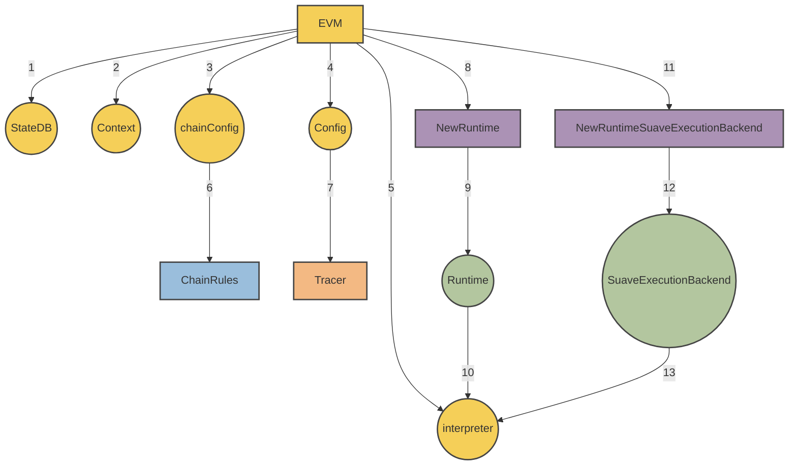

<div class="hideInDocs">

<!-- omit from toc -->
# MEVM

<!-- TOC -->

- [Overview](#overview)
- [Modified Interpreter](#modified-interpreter)
    - [Confidential Data Store APIs](#confidential-data-store-apis)
    - [`suavex` namespace](#suavex-namespace)
- [Precompile Call Authorization](#precompile-call-authorization)
- [Security and Confidentiality](#security-and-confidentiality)

<!-- /TOC -->

---

## Overview

</div>

This document provides the technical specification for the MEVM, a modified version of the Ethereum Virtual Machine (EVM). The MEVM is a set of precompiles to interact with APIs; two of these API services are the Confidential Data Store and the SUAVE Execution (SUAVEX) namespace. There may be other API endpoints in the future.

## Modified Interpreter

Under the hood, the MEVM is a modified EVM Interpreter which is able to use a new runtime called the `SuaveExecutionBackend`.



The `SuaveExecutionBackend` is responsible for exposing the APIs that precompiles can hook into.

```go
type SuaveExecutionBackend struct {
	ConfidentialStore      ConfidentialStore
	ConfidentialEthBackend suave.ConfidentialEthBackend
}
```

#### Confidential Data Store APIs

For more information on the capabilities exposed by the Confidential Data Store, see its related [🔗 spec](./confidential-data-store.md). The interface exposed to precompiles:

```go
type ConfidentialStore interface {
	InitializeBid(bid types.Bid) (types.Bid, error)
	Store(bidId suave.BidId, caller common.Address, key string, value []byte) (suave.Bid, error)
	Retrieve(bid types.BidId, caller common.Address, key string) ([]byte, error)
	FetchBidById(suave.BidId) (suave.Bid, error)
	FetchBidsByProtocolAndBlock(blockNumber uint64, namespace string) []suave.Bid
}
```

#### `suavex` namespace

The `suavex` namespace is used internally by the MEVM to enable functionality like block building and external API calls via MEVM precompiles. We take this approach to make upstream updates and maintenance easier. Current endpoints include:

`suavex_buildEthBlockFromBundles` - takes an array of bundles and transactions, calculates state root and related fields, and returns a valid Ethereum L1 block.

```go
BuildEthBlockFromBundles(ctx context.Context, buildArgs *types.BuildBlockArgs, bundles []types.SBundle) (*engine.ExecutionPayloadEnvelope, error)
```

`suavex_buildEthBlock` - takes an array of transactions, calculates state root and related fields, and returns a valid Ethereum L1 block.

```go
BuildEthBlock(ctx context.Context, buildArgs *types.BuildBlockArgs, txs types.Transactions) (*engine.ExecutionPayloadEnvelope, error)
```

Domain specific services which seek to be used by SUAVE must implement the methods in this namespace. More details will be expanded in future iterations.


##  Precompile Call Authorization
`checkIsPrecompileCallAllowed` implements the access control functionality. It validates whether a precompile and associated callers are authorized to access specific data. Key security functionality is as follows:

1. **Universal Access**: If a `ConfidentialComputeRequest` allows "any peeker", the function searches the `CallerStack` for a caller different from the precompile, granting access upon finding one.

2. **Restricted Access and Validation**:
   - The function checks if the precompile is explicitly authorized to access bid data.
   - It then validates each caller in the `CallerStack` against the `AllowedPeekers` list. If an authorized caller is found, access is granted.

3. **Error Handling**:
   - Access is denied, with an error returned, if no authorized caller is found or if the precompile lacks authorization and is not a special case (like confStore addresses).


## Security and Confidentiality

`checkIsPrecompileCallAllowed` ensures that either the precompile or one of its callers must be authorized for access, enhancing security by strict validation of permissions. This approach is necessary for maintaining data integrity and preventing unauthorized access, but ultimately not entirely sufficient for total confidentiality. Future iterations will delve deeper into encryption methodologies, access controls, and auditing mechanisms to fortify data privacy further, as well as Trusted Execution Environment to ensure access control is maintained.
