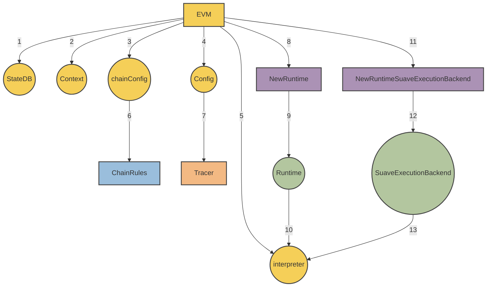

<!-- omit from toc -->
# MEVM

<div class="hideInDocs">

**Table of Contents**

<!-- TOC -->

- [Overview](#overview)
- [Core Architecture](#core-architecture)
  - [SuaveExecutionBackend](#suaveexecutionbackend)
  - [MEVM Interpreter](#mevm-interpreter)
- [Additional Capabilities](#additional-capabilities)
  - [Confidential execution of smart contracts](#confidential-execution-of-smart-contracts)
  - [Confidential APIs](#confidential-apis)
- [Suave JSON-RPC](#suave-json-rpc)

<!-- /TOC -->

---

</div>

## Overview

This document provides the technical specification for the MEVM, a modified version of the Ethereum Virtual Machine (EVM). The MEVM enables confidential computation via the `SuaveExecutionBackend`, as well as providing an extended set of APIs.

## Core Architecture

The MEVM modifies the EVM by adding a new runtime, interpreter, and execution backend. This means that the MEVM has the extra components required to access confidential information (when allowed), and leverage a set of new precompiles tailored for MEV applications.

The structure of these modifications is most easily explained visually:



### SuaveExecutionBackend

Functioning as a foundation for the MEVM, the `SuaveExecutionBackend` facilitates the execution of confidential processes. Key features include:

- **Confidential APIs**: Dedicated endpoints for secure data interactions.
- **Confidential Input Management**: Streamlined processing of confidential data inputs.
- **Caller Stack Tracing**: Tracing capabilities for tracking transaction initiators.

Reference Implementation (Golang):

```go
type SuaveExecutionBackend struct {
    ConfidentialStoreEngine *suave.ConfidentialStoreEngine
    MempoolBackend          suave.MempoolBackend
    ConfidentialEthBackend  suave.ConfidentialEthBackend
}
```

### MEVM Interpreter

The modified interpreter not only handles standard EVM operations but also caters to the complexities introduced by confidential computations.

In our current [suave-geth](https://github.com/flashbots/suave-geth/) reference implementation this looks like:

- Introduction of `IsConfidential` to the interpreter's configuration.
- Alterations to the `Run` function to accommodate confidential APIs.
- Modifications to the `Run` function to trace the caller stack.

The capabilities enabled by this modified interpreter are exposed to the virtual machine via `SuaveContext` and its components.

```go
type SuaveContext struct {
    Backend                      *SuaveExecutionBackend
    ConfidentialComputeRequestTx *types.Transaction
    ConfidentialInputs           []byte
    CallerStack                  []*common.Address
}

```

## Additional Capabilities

The MEVM adds several capabilities to the regular EVM.

### Confidential execution of smart contracts

The virtual machine (MEVM) inside SUAVE nodes have two modes of operation: regular and confidential.

Regular mode is equivalent to the usual Ethereum virtual machine environment, with all computation occurring on-chain.

Confidential mode accesses additional precompiles, both directly and through a convenient [library](https://github.com/flashbots/suave-geth/blob/main/suave/sol/libraries/Suave.sol). Confidential execution is *not* verifiable during on-chain state transition. The result of the confidential execution is instead cached in the `SuaveTransaction`.

Users requesting confidential compute specify which SUAVE computor they trust with execution.

The cached result of confidential execution is used as calldata in the `SuaveTransaction` that is included in the SUAVE chain. This transaction is verified by comparing the signature of the SUAVE computor which submitted the result against the public key specified by the user when requesting confidential compute.

Other than the ability to access new precompiles, contracts which enable confidential execution are written as usual in Solidity (or any other language) and compiled to EVM bytecode.

### Confidential APIs

In the [suave-geth](https://github.com/flashbots/suave-geth/tree/main) reference implementation, confidential precompiles have access to the following [Confidential APIs](https://github.com/flashbots/suave-geth/tree/main/suave/core/types.go) during execution.

This is subject to change!

```go
type ConfidentialStoreEngine interface {
    Initialize(bid Bid, creationTx *types.Transaction, key string, value []byte) (Bid, error)
    Store(bidId BidId, sourceTx *types.Transaction, caller common.Address, key string, value []byte) (Bid, error)
    Retrieve(bid BidId, caller common.Address, key string) ([]byte, error)
}

type MempoolBackend interface {
    SubmitBid(Bid) error
    FetchBidById(BidId) (Bid, error)
    FetchBidsByProtocolAndBlock(blockNumber uint64, namespace string) []Bid
}

type ConfidentialEthBackend interface {
    BuildEthBlock(ctx context.Context, args *BuildBlockArgs, txs types.Transactions) (*engine.ExecutionPayloadEnvelope, error)
    BuildEthBlockFromBundles(ctx context.Context, args *BuildBlockArgs, bundles []types.SBundle) (*engine.ExecutionPayloadEnvelope, error)
}
```

## Suave JSON-RPC

SUAVE JSON-RPC can be seen as a super set of Ethereum JSON-RPC. This means that the [Ethereum JSON-RPC standard](https://geth.ethereum.org/docs/interacting-with-geth/rpc) remains the same when interacting with the SUAVE chain, with the following exceptions:

1. New `IsConfidential` and `ExecutionNode` fields are added to the transaction arguments used in the `eth_sendTransaction` and `eth_call` methods.
    1. If `IsConfidential` is set to true, the call will be performed as a confidential call, using the SUAVE Computor passed in when constructing a `ConfidentialComputeRequest`.
    2. A `SuaveTransaction` is the result of `eth_sendTransaction`. If `IsConfidential` is unset or false in the request, this `SuaveTransaction` will be processed as a regular Ethereum Legacy or EIP1559 transaction.

2. New optional argument - `confidential_data` - is added to `eth_sendRawTransaction`, `eth_sendTransaction` and `eth_call` methods.
    1. Confidential data is made available to the MEVM via a precompile, but does not become a part of the transaction that makes it to chain.

3. All RPCs that return transaction or receipt objects will do so with type `SuaveTransaction`, a super set of regular Ethereum transactions.

### `suavex` namespace

The `suavex` namespace is used internally by the MEVM to enable functionality like block building and external API calls via MEVM precompiles. We take this approach to make upstream updates and maintenance easier. Current endpoints include:

#### Methods

`suavex_buildEthBlockFromBundles` - takes an array of bundles and transactions, calculates state root and related fields, and returns a valid Ethereum L1 block.

`suavex_buildEthBlock` - takes an array of transactions, calculates state root and related fields, and returns a valid Ethereum L1 block.


Domain specific services which seek to be used by SUAVE must implement the methods in this namespace. More details will be expanded in future iterations.