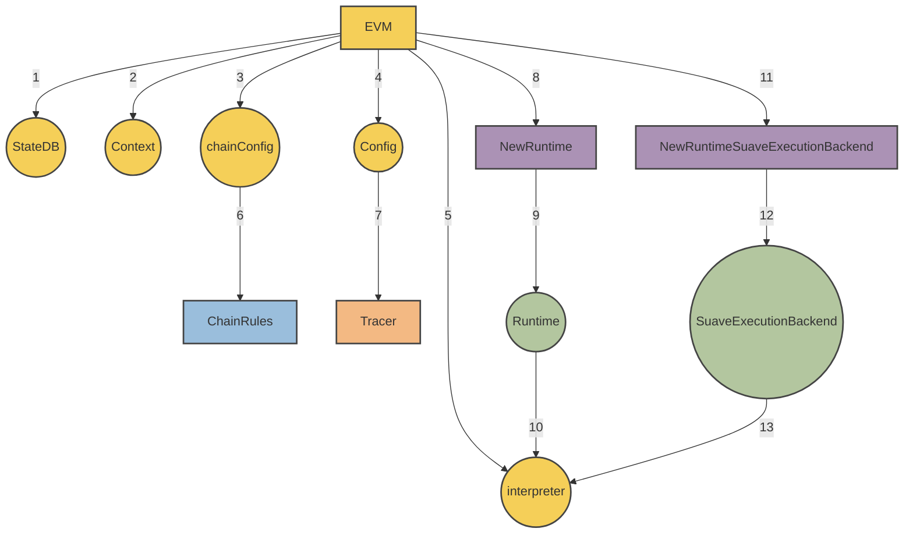

<!-- TOC -->

- [MEVM](#mevm)
    - [Overview](#overview)
    - [Core Architecture](#core-architecture)
        - [SuaveExecutionBackend](#suaveexecutionbackend)
        - [MEVM Interpreter](#mevm-interpreter)
        - [Confidential APIs](#confidential-apis)
    - [Suave JSON-RPC](#suave-json-rpc)
        - [Confidential Execution of Smart Contracts](#confidential-execution-of-smart-contracts)
        - [suavex namespace](#suavex-namespace)
            - [Methods](#methods)
    - [Precompiles Governance](#precompiles-governance)
    - [Precompiles](#precompiles)
        - [IsConfidential](#isconfidential)
        - [ConfidentialInputs](#confidentialinputs)
        - [ConfidentialStore](#confidentialstore)
        - [ConfidentialRetrieve](#confidentialretrieve)
        - [NewBid](#newbid)
        - [FetchBids](#fetchbids)
        - [SimulateBundle](#simulatebundle)
        - [ExtractHint](#extracthint)
        - [BuildEthBlock](#buildethblock)
        - [SubmitEthBlockBidToRelay](#submitethblockbidtorelay)

<!-- /TOC -->

---

</div>

## Overview

This document provides the technical specification for the MEVM, a modified version of the Ethereum Virtual Machine (EVM). The MEVM enables confidential computation via the `SuaveExecutionBackend` and as well exposes additional MEV-specific precompiles for SUAPPs to use. 

## Core Architecture

The MEVM modifies the EVM by adding a new:
- runtime
- interpreter
- execution backend

The structure of these modifications is most easily explained visually:



### SuaveExecutionBackend

`SuaveExecutionBackend` is used by precompiles to access the confidential store as well as functionality in the SUAVE ex namespace which is detailed later on.

```go
type SuaveExecutionBackend struct {
	ConfidentialStore      ConfidentialStore
	ConfidentialEthBackend suave.ConfidentialEthBackend
}
```

### SuaveContext

The MEVM provides three differences over the stock EVM interpreter.

- Introduction of `IsConfidential` to the interpreter's configuration allow for introspection on computation mode.
- Alterations to the `Run` function to accommodate confidential APIs.
- Modifications to the `Run` function to trace the caller stack.

The capabilities enabled by this modified interpreter are exposed to the virtual machine via `SuaveContext` which maintains the runtime state and context for Suave operations.

```go
type SuaveContext struct {
    Backend                      *SuaveExecutionBackend
    ConfidentialComputeRequestTx *types.Transaction
    ConfidentialInputs           []byte
    CallerStack                  []*common.Address
}

```

### Confidential APIs

In the [suave-geth](https://github.com/flashbots/suave-geth/tree/main) reference implementation, confidential precompiles have access to the following [Confidential APIs](https://github.com/flashbots/suave-geth/tree/main/suave/core/types.go) during execution.

This is subject to change!

```go
type ConfidentialStoreEngine struct {
	ctx    context.Context
	cancel context.CancelFunc

	storage        ConfidentialStorageBackend
	transportTopic StoreTransportTopic

	daSigner    DASigner
	chainSigner ChainSigner

	storeUUID      uuid.UUID
	localAddresses map[common.Address]struct{}
}

type ConfidentialStorageBackend interface {
	InitializeBid(bid suave.Bid) error
	Store(bid suave.Bid, caller common.Address, key string, value []byte) (suave.Bid, error)
	Retrieve(bid suave.Bid, caller common.Address, key string) ([]byte, error)
	FetchBidById(suave.BidId) (suave.Bid, error)
	FetchBidsByProtocolAndBlock(blockNumber uint64, namespace string) []suave.Bid
	Stop() error
}
```

## Suave JSON-RPC

SUAVE JSON-RPC can be seen as a super set of Ethereum JSON-RPC. This means that the [Ethereum JSON-RPC standard](https://geth.ethereum.org/docs/interacting-with-geth/rpc) remains the same when interacting with the SUAVE chain, with the following exceptions:

1. Suave JSON-RPC has two modes of operation: regular and confidential determined by the truth value of `IsConfidential` in the Confidential Compute Request.
- *Regular mode* is equivalent to the usual Ethereum virtual machine environment, with all computation occurring onchain and requests are made with SUAVE transactions instead of Confidential Compute Requests.
- *Confidential mode* accesses additional precompiles, both directly and through a convenient [library](https://github.com/flashbots/suave-geth/blob/main/suave/sol/libraries/Suave.sol). Confidential execution is *not* verifiable during on-chain state transition. The result of the confidential execution is instead cached in the `SuaveTransaction`.

2. New optional argument - `confidential_data` - is added to `eth_sendRawTransaction`, `eth_sendTransaction` and `eth_call` methods.
- Confidential data is made available to the MEVM via a precompile, but does not become a part of the transaction that makes it to chain.

3. All RPCs that return transaction or receipt objects will do so with type `SuaveTransaction`, a super set of regular Ethereum transactions.


### `suavex` namespace

The `suavex` namespace is used internally by the MEVM to enable functionality like block building and external API calls via MEVM precompiles. We take this approach to make upstream updates and maintenance easier. Current endpoints include:

#### Methods

`suavex_buildEthBlockFromBundles` - takes an array of bundles and transactions, calculates state root and related fields, and returns a valid Ethereum L1 block.

`suavex_buildEthBlock` - takes an array of transactions, calculates state root and related fields, and returns a valid Ethereum L1 block.


Domain specific services which seek to be used by SUAVE must implement the methods in this namespace. More details will be expanded in future iterations.


## Precompiles

### `IsConfidential`

Implementation (link-to-github-or-other-source)

Address: `0x42010000`

Determines if the current execution mode is regular (on-chain) or confidential. Outputs a boolean value.

### `ConfidentialInputs`

Implementation (link-to-github-or-other-source)

Address: `0x42010001`

Provides the confidential inputs associated with a confidential computation request. Outputs are in bytes format.

### `ConfidentialStore`

Implementation (link-to-github-or-other-source)

Address: `0x42020000`

Handles the storage of values in the confidential store. Requires the caller to be part of the `AllowedPeekers` for the associated bid.

### `ConfidentialRetrieve`

Implementation (link-to-github-or-other-source)

Address: `0x42020001`

Retrieves values from the confidential store. Also mandates the caller's presence in the `AllowedPeekers` list for the bid.

### `NewBid`

Implementation (link-to-github-or-other-source)

Address: `0x42030000`

Initializes bids within the ConfidentialStore. Prior to storing data, all bids should undergo initialization via this precompile.

### `FetchBids`

Implementation (link-to-github-or-other-source)

Address: `0x42030001`

Retrieves all bids correlating with a specified decryption condition.

### `SimulateBundle`

Implementation (link-to-github-or-other-source)

Address: `0x42100000`

Conducts a simulation of the bundle, building a block that includes it. Outputs indicate if the apply was successful and the EGP of the resultant block.

### `ExtractHint`

Implementation (link-to-github-or-other-source)

Address: `0x42100037`

Interprets the bundle data and extracts hints, such as the "To" address and calldata.

### `BuildEthBlock`

Implementation (link-to-github-or-other-source)

Address: `0x42100001`

Constructs an Ethereum block based on the provided bid. The construction follows a specified order.

### `SubmitEthBlockBidToRelay`

Implementation (link-to-github-or-other-source)

Address: `0x42100002`

Submits a given builderBid to a boost relay. Outputs any errors that arise during submission.

## Precompiles Governance

Here is a rough outline of the initial governance process for adding precompiles:

- Discuss the idea in a [forum post](https://collective.flashbots.net/)
- Open a PR and provide implementation
- Feedback and review
- Possibly merge and deploy in the next network upgrade