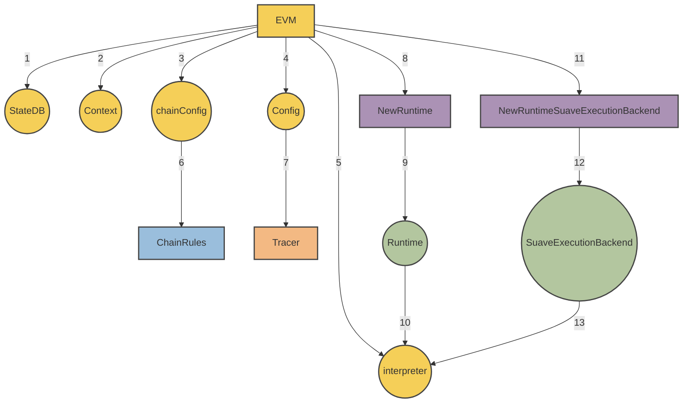

# MEVM

## Table of Contents
1. Overview
2. Core Architecture
   - 2.1. `SuaveExecutionBackend`
   - 2.2. `MEVM Interpreter`
3. Features and Enhancements
   - 3.1. Confidential Execution of Smart Contracts
   - 3.2. Confidential APIs
4. Data Flow and Processes
5. Security Considerations

## Overview

This document provides the technical specification for the `mevm` system, a modified version of the Ethereum Virtual Machine (EVM). With the integration of `SuaveExecutionBackend`, the `mevm` introduces confidential computation and allows for enhanced interaction with APIs.

## Core Architecture

The MEVM is a modified runtime exposed to the EVM. The MEVM is a combination of an interpreter as well as a `SuaveExecutionBackend`. A diagram from our [suave-geth](https://github.com/flashbots/suave-geth/tree/main)  reference implementation can be seen below.




### SuaveExecutionBackend

Functioning as a foundation for the MEVM, the `SuaveExecutionBackend` facilitates the execution of confidential processes. Key features include:

- **Confidential APIs**: Dedicated endpoints for secure data interactions.
- **Confidential Input Management**: Streamlined processing of confidential data inputs.
- **Caller Stack Tracing**: Tracing capabilities for tracking transaction initiators.

Reference Implementation (Golang):

```go
type SuaveExecutionBackend struct {
    ConfidentialStoreEngine *suave.ConfidentialStoreEngine
    MempoolBackend          suave.MempoolBackend
    ConfidentialEthBackend  suave.ConfidentialEthBackend
}
```

### MEVM Interpreter

The modified interpreter not only handles standard EVM operations but also caters to the complexities introduced by confidential computations. 

In our current [suave-geth](https://github.com/flashbots/suave-geth/tree/main) reference implementation this looks like:

- Introduction of `IsConfidential` to the interpreter's configuration.
- Alterations to the `Run` function to accommodate confidential APIs.
- Modifications to the `Run` function to trace the caller stack.

From the [suave-geth](https://github.com/flashbots/suave-geth/tree/main)  reference implementation, the capabilities enabled by this modified interpreter are exposed to the virtual machine via `SuaveContext` and its components.

```go
type SuaveContext struct {
    Backend                      *SuaveExecutionBackend
    ConfidentialComputeRequestTx *types.Transaction
    ConfidentialInputs           []byte
    CallerStack                  []*common.Address
}

```

## Features and Enhancements

### Confidential execution of smart contracts

The virtual machine (MEVM) inside SUAVE nodes have two modes of operation: regular and confidential. Regular on-chain environment is your usual Ethereum virtual machine environment.

Confidential environment is available to users through a new type of transaction - `ConfidentialComputeRequest` via the usual jsonrpc methods `eth_sendRawTransaction`, `eth_sendTransaction` and `eth_call`. Simulations (`eth_call`) requested with a new optional argument `IsConfidential` are also executed in the confidential mode. For more on confidential requests see [confidential compute requests](#confidential-compute-requests).

The confidential execution environment provides additional precompiles, both directly and through a convenient [library](#suave-library). Confidential execution is *not* verifiable during on-chain state transition, instead the result of the confidential execution is cached in the transaction (`SuaveTransaction`). Users requesting confidential compute requests specify which execution nodes they trust with execution, and the execution nodes' signature is used for verifying the transaction on-chain.

The cached result of confidential execution is used as calldata in the transaction that inevitably makes its way onto the SUAVE chain.

Other than ability to access new precompiles, the contracts aiming to be executed confidentially are written as usual in Solidity (or any other language) and compiled to EVM bytecode.


### Confidential APIs

In our [suave-geth](https://github.com/flashbots/suave-geth/tree/main)  referene implementation, confidential precompiles have access to the following [Confidential APIs](suave/core/types.go) during execution.  
This is subject to change!  

```go
type ConfidentialStoreEngine interface {
    Initialize(bid Bid, creationTx *types.Transaction, key string, value []byte) (Bid, error)
    Store(bidId BidId, sourceTx *types.Transaction, caller common.Address, key string, value []byte) (Bid, error)
    Retrieve(bid BidId, caller common.Address, key string) ([]byte, error)
}

type MempoolBackend interface {
    SubmitBid(Bid) error
    FetchBidById(BidId) (Bid, error)
    FetchBidsByProtocolAndBlock(blockNumber uint64, namespace string) []Bid
}

type ConfidentialEthBackend interface {
    BuildEthBlock(ctx context.Context, args *BuildBlockArgs, txs types.Transactions) (*engine.ExecutionPayloadEnvelope, error)
    BuildEthBlockFromBundles(ctx context.Context, args *BuildBlockArgs, bundles []types.SBundle) (*engine.ExecutionPayloadEnvelope, error)
}
```


## Data Flow and Processes

TODO: Insert data flow diagram and explanation

## Security Considerations

TODO: security short comings


To correct the table of contents, I've removed entries that don't correspond to actual sections in your content and added ones that do. Here's the revised table of contents for your `MEVM` document:
