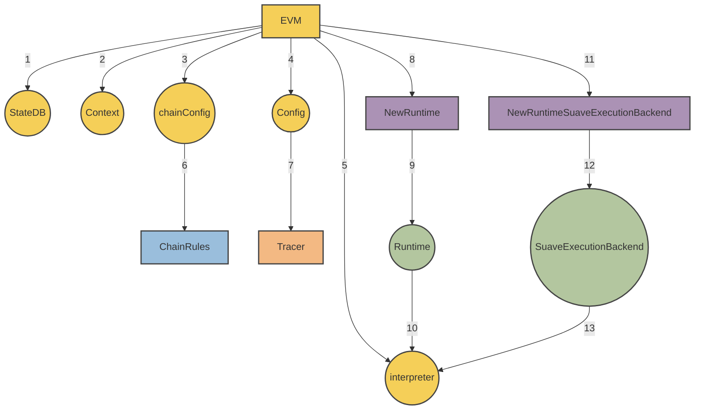

<!-- TOC -->

- [Overview](#overview)
- [Modified Interpreter](#modified-interpreter)
- [Precompiles](#precompiles)
    - [Confidential Data Store APIs](#confidential-data-store-apis)
    - [suavex namespace](#suavex-namespace)
    - [Available Precompiles](#available-precompiles)
        - [IsConfidential](#isconfidential)
        - [ConfidentialInputs](#confidentialinputs)
        - [ConfidentialStore](#confidentialstore)
        - [ConfidentialRetrieve](#confidentialretrieve)
        - [NewBid](#newbid)
        - [FetchBids](#fetchbids)
        - [SimulateBundle](#simulatebundle)
        - [ExtractHint](#extracthint)
        - [BuildEthBlock](#buildethblock)
        - [SubmitEthBlockBidToRelay](#submitethblockbidtorelay)
- [Precompiles Governance](#precompiles-governance)

<!-- /TOC -->

---

</div>

## Overview

This document provides the technical specification for the MEVM, a modified version of the Ethereum Virtual Machine (EVM). The MEVM is a set of precompiles to interact with APIs, two of these API services are the Confidential Data Store and the SUAVE Execution (SUAVEX) name space. There may be other API endpoints in the future.

## Modified Interpreter

Under the hood the MEVM is a modified EVM Interpreter which is able to use a new runtime called the `SuaveExecutionBackend`.



The `SuaveExecutionBackend` is responsible for exposing the APIs that precompiles are able to hook into.

```go
type SuaveExecutionBackend struct {
	ConfidentialStore      ConfidentialStore
	ConfidentialEthBackend suave.ConfidentialEthBackend
}
```

## Precompiles


Precompile are MEVM contracts that are implemented in native code instead of bytecode. Precompiles additonally can communicate with internal APIs. Currently the MEVM introduces four new types of precompiles:
- offchain computation that is too expensive in solidity
- calls to API methods to interact with the Confidential Data Store
- calls to `sauvex` API Methods to interact with Domain Specific Services 
- calls to retrieve context for the confidential compute requests

### Confidential Data Store APIs

For more information on the capabilities exposed by the Confidential Data Store, see it's related [🔗 spec](/specs/rigil/confidential-data-store.md). The interface exposed to precompiles:

```go
type ConfidentialStore interface {
	InitializeBid(bid types.Bid) (types.Bid, error)
	Store(bidId suave.BidId, caller common.Address, key string, value []byte) (suave.Bid, error)
	Retrieve(bid types.BidId, caller common.Address, key string) ([]byte, error)
	FetchBidById(suave.BidId) (suave.Bid, error)
	FetchBidsByProtocolAndBlock(blockNumber uint64, namespace string) []suave.Bid
}
```

### `suavex` namespace

The `suavex` namespace is used internally by the MEVM to enable functionality like block building and external API calls via MEVM precompiles. We take this approach to make upstream updates and maintenance easier. Current endpoints include:

`suavex_buildEthBlockFromBundles` - takes an array of bundles and transactions, calculates state root and related fields, and returns a valid Ethereum L1 block.

`suavex_buildEthBlock` - takes an array of transactions, calculates state root and related fields, and returns a valid Ethereum L1 block.


Domain specific services which seek to be used by SUAVE must implement the methods in this namespace. More details will be expanded in future iterations.

### Available Precompiles

#### `IsConfidential`

TODO: 🔗 Implementation 

Address: `0x42010000000000000000000000000000000000`

Determines if the current execution mode is regular (on-chain) or confidential. Outputs a boolean value.

#### `ConfidentialInputs`

TODO: 🔗 Implementation 

Address: `0x42010001000000000000000000000000000000`

Provides the confidential inputs associated with a confidential computation request. Outputs are in bytes format.

#### `ConfidentialStore`

TODO: 🔗 Implementation 

Address: `0x42020000000000000000000000000000000000`

Handles the storage of values in the confidential store. Requires the caller to be part of the `AllowedPeekers` for the associated bid.

#### `ConfidentialRetrieve`

TODO: 🔗 Implementation 

Address: `0x42020001000000000000000000000000000000`

Retrieves values from the confidential store. Also mandates the caller's presence in the `AllowedPeekers` list for the bid.

#### `NewBid`

TODO: 🔗 Implementation 

Address: `0x42030000000000000000000000000000000000`

Initializes bids within the ConfidentialStore. Prior to storing data, all bids should undergo initialization via this precompile.

#### `FetchBids`

TODO: 🔗 Implementation 

Address: `0x42030001000000000000000000000000000000`

Retrieves all bids correlating with a specified decryption condition.

#### `SimulateBundle`

TODO: 🔗 Implementation 

Address: `0x42100000000000000000000000000000000000`

Conducts a simulation of the bundle, building a block that includes it. Outputs indicate if the apply was successful and the EGP of the resultant block.

#### `ExtractHint`

TODO: 🔗 Implementation 

Address: `0x42100037000000000000000000000000000000`

Interprets the bundle data and extracts hints, such as the "To" address and calldata.

#### `BuildEthBlock`

TODO: 🔗 Implementation 

Address: `0x0042100001000000000000000000000000000000`

Constructs an Ethereum block based on the provided bid. The construction follows a specified order.

#### `SubmitEthBlockBidToRelay`

TODO: 🔗 Implementation 

Address: `0x42100002000000000000000000000000000000`

Submits a given builderBid to a boost relay. Outputs any errors that arise during submission.

## Precompiles Governance

Governance process for adding precompiles is in it's early stages but is as follows:
- Discuss the idea in a [forum post](https://collective.flashbots.net/)
- Open a PR and provide implementation
- Feedback and review
- Possibly merge and deploy in the next network upgrade, or sooner, depending on the precompile