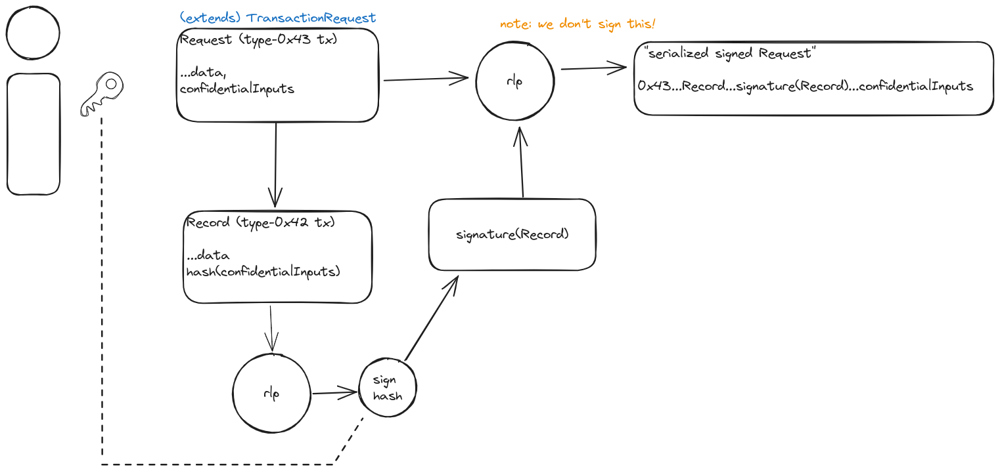

<div class="hideInDocs">

<!-- omit from toc -->
# Suave Chain

**Table of Contents**

<!-- TOC -->

- [Overview](#overview)
- [Configuration](#configuration)
  - [Network Parameters](#network-parameters)
  - [Genesis Settings](#genesis-settings)
- [Consensus Mechanism: Proof-of-Authority (Clique)](#consensus-mechanism-proof-of-authority-clique)
  - [Geth Version](#geth-version)
- [Suave Transaction](#suave-transaction)
- [Node Requirements and Setup](#node-requirements-and-setup)
- [Gas and Transaction Fees](#gas-and-transaction-fees)
- [Security Considerations](#security-considerations)

<!-- /TOC -->

---

## Overview

</div>

This document outlines the specifications for the SUAVE Rigil chain.

In the context of the SUAVE protocol, the primary purpose of the SUAVE chain is to reach (and maintain) consensus about smart contract code for use cases such as order flow auctions, solvers, block builders, etc. Additionally, the SUAVE chain can also be used to store and broadcast data for better censorship guarantees.

In the initial phases of development, the SUAVE chain runs a proof-of-authority consensus protocol called Clique, over a network of permissioned nodes. We do so to experiment and iterate quickly during protocol development. This will change in later testnets.

## Configuration

### Network Parameters

- **Network ID**: `16813125`
- **Chain ID**: `16813125`

### Genesis Settings

| Name             | Value    | Unit     |
| ---------------- | -------- | -------- |
| `PERIOD`         | 4        | `block`  |
| `EPOCH`          | 30000    | `block`  |
| `BLOCK_TIME`     | 3        | `second` |
| `GAS_LIMIT`      | 30000000 | `gas`    |
| `NUM_VALIDATORS` | 5        | Nodes    |


## Consensus Mechanism: Proof-of-Authority (Clique)

Clique, an Ethereum-based Proof-of-Authority consensus protocol defined [here](https://eips.ethereum.org/EIPS/eip-225#:~:text=A%20PoA%20scheme%20is%20based,the%20list%20of%20trusted%20signers), restricts block minting to a predefined list of trusted signers. Because of this, every block header a client sees can be checked against the list of trusted signers.


### Geth Version

Suave-geth is based on geth v1.12.0 ([`e501b3`](https://github.com/flashbots/suave-geth/commit/e501b3b05db8e169f67dc78b7b59bc352b3c638d)).

---

## Suave Transaction

The SUAVE protocol adds a new transaction type to the base Ethereum protocol called a `SuaveTransaction`. The purpose of this new transaction type is to process fees for offchain computation and to support the new data primitives associated with confidential compute.

Blocks on the SUAVE chain consist of lists of SUAVE transactions. This new transaction type facilitates and captures key information involved in Confidential Compute Requests and their subsequent results. Any `ConfidentialComputeRequest`, signed by the user, specifies an `ExecutionNode`. SUAVE transactions are valid if and only if they are signed by the `ExecutionNode` specified by the user in the original `ConfidentialComputeRequest`, which is included as the `ConfidentialComputeRecord`.

```go
type SuaveTransaction struct {
	ExecutionNode              common.Address
	ConfidentialComputeRequest ConfidentialComputeRecord
	ConfidentialComputeResult  []byte

	// ExecutionNode's signature
	ChainID *big.Int
	V       *big.Int
	R       *big.Int
	S       *big.Int
}
```

## Node Requirements and Setup

- **Hardware**:
    - Minimum 8GB RAM, four cores, 50GB SSD (How big do we expect the chain to grow?)
    - These requirements will eventually incorporate Trusted Execution Environments (TEEs).
- **Software**: [suave-geth](https://github.com/flashbots/suave-geth/)
- **Setup Steps**:
    1. Clone suave-geth
    2. Start the devnet: `make devnet-up`
    3. Create transactions: `go run suave/devenv/cmd/main.go`

---

## Gas and Transaction Fees

The SUAVE chain employs the same gas pricing mechanism as Ethereum pre-Cancun hardfork (no blob transactions) where gas prices adjust based on network demand. Nodes currently track Confidential Compute Request gas usage but only charge a small flat fee for it, and there is no cap for offchain compute.

Currently, SUAVE transactions can only be expressed as Legacy transaction types, but they will get converted into EIP-1559 base fee model under the hood.

---

## Security Considerations

- **Security Risk**: The protocol is unaudited. The protocol currently does not make any guarantees about the confidentiality of data in the network outside of a best effort.
- **DoS Risk**: Nodes have not yet been reviewed, and there may be DoS vectors at this early stage.
- **Secure Key Management**: Storing private keys on Suave is experimental and should be considered insecure.

If you find a security vulnerability in SUAVE, please email us at security@flashbots.net.

---

## TransactionRequest Serialization & Signing

Transactions sent by users of SUAVE can take on two forms: standard (legacy) Ethereum transactions, and `ConfidentialComputeRequest`s.

Standard transactions are used to tranfer SUAVE-ETH and deploy smart contracts to SUAVE. ConfidentialComputeRequests are used to interact with SUAVE smart contracts.

All transactions are encoded with the [EIP-2718](https://eips.ethereum.org/EIPS/eip-2718) RLP-encoding scheme (with [EIP-2930](https://eips.ethereum.org/EIPS/eip-2930) allowed), but `ConfidentialComputeRequest` takes on a special signature scheme that deviates slightly from the traditional scheme.



From the client perspective (i.e. a JSON-RPC client connected to SUAVE-geth) `ConfidentialComputeRequest` looks something like this:

```js
const cRequest = {
  confidentialInputs: '0x000000000000000000000000000000000000000000000000000000000000002000000000000000000000000000000000000000000000000000000000000000fd7b22626c6f636b4e756d626572223a22307830222c22747873223a5b2230786638363538303064383235323038393461646263653931303332643333396338336463653834316336346566643261393232383165653664383230336538383038343032303131386164613038376337386234353663653762343234386237313565353164326465656236343031363032343832333735663130663037396663666637373934383830653731613035373366336364343133396437323037643165316235623263323365353438623061316361336533373034343739656334653939316362356130623661323930225d2c2270657263656e74223a31307d000000',
  executionNode: '0xb5feafbdd752ad52afb7e1bd2e40432a485bbb7f',
  to: '0x8f21Fdd6B4f4CacD33151777A46c122797c8BF17',
  gasPrice: 10000000000n,
  gas: 420000n,
  type: '0x43',
  chainId: 16813125,
  data: '0x236eb5a70000000000000000000000000000000000000000000000000000000000000002000000000000000000000000000000000000000000000000000000000000006000000000000000000000000000000000000000000000000000000000000000a000000000000000000000000000000000000000000000000000000000000000010000000000000000000000008f21fdd6b4f4cacd33151777a46c122797c8bf170000000000000000000000000000000000000000000000000000000000000000',
  }
```

To serialize, sign, and send this request, the client must first RLP-encode the request as a `ConfidentialComputeRecord` and sign its hash.

```js
const cRecord = {
  ...cRequest,
  type: '0x42',
}
const rlpRecord = rlp(cRecord.type, [
    nonce,
    gasPrice,
    gas,
    to,
    value,
    data,
    executionNode,
    keccak256(confidentialInputs),
    chainId,
  ])
const signedRecord = wallet.sign(keccak256(rlpRecord))
```

Then, the final request is re-encoded with RLP as follows:

```js
const tx = rlp('0x43', [
    cRecord.nonce,
    cRecord.gasPrice,
    cRecord.gas,
    cRecord.to,
    cRecord.value,
    cRecord.data,
    cRecord.executionNode,
    keccak256(cRequest.confidentialInputs),
    cRecord.chainId,
    cRecord.v === 27n ? '0x' : '0x1', // yParity
    cRecord.r,
    cRecord.s,
  ],
  confidentialInputs
)
```

This is then sent to SUAVE via `eth_sendRawTransaction`:

```js
wallet.request('eth_sendRawTransaction', [tx])
```
